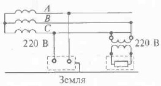
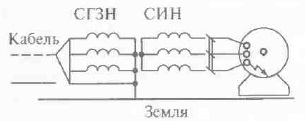

___
# Вопрос 23: Защитное разделение сетей. Назначение, принцип действия, конструктивное исполнение, область применения.
___

### Область примерения

Электроустановки напряжением до 1000 В, эксплуатация которых связана с повышенными требованиями электробезопасности (передвижные электроустановки, ручной электроинструмент и т.п.)

Защитное электрическое разделение цепей - отделение одной части электрической цепи от других в электроустановках напряжением от 1 кВ с помощью двойной изоляции, основной изоляции и защитного экрана иили усиленной изоляции.

**Принципы** защиты в данном случае основаны на преобразовании одной сети или цепи, опасной для человека, в другую, относительно безопасности.

### Пример

При питании рабочим напряжением 380 или 220 В СГЗН (IT) сети может быть преобразована в трёхфазную или однофазную СИН (TN) того же напряжения с помощью разделительного трансформатора (первичная обмотка отделена от вторичных обмоток при помощи защитного электрического разделения цепей), в котором сопротивление изоляции относительно земли большое, а ёмкость фаз (полюсов) очень мала.

