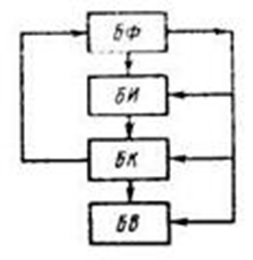

___
# Вопрос 27: Методы контроля сопротивления электрической изоляции.
___

### Понятие контроля изоляции

*Контроль изоляции* — измерение ее активного или омического сопротивления для обнаружения дефектов и предупреждения замыканий на землю и коротких замыканий. Состояние изоляции в значительной мере определяет степень безопасности эксплуатации электроустановок, поскольку сопротивление изоляции в сетях с изолированной нейтралью определяет величину тока замыкания на землю, а значит, и тока, проходящего через человека. В сетях напряжением выше 1000 В снижение сопротивления изоляции почти всегда приводит к пробою изоляции и глухому замыканию на землю.
В электрических сетях и электроприемниках, изолированных от земли, условия электробезопасности и надежности энергоснабжения в значительной мере определяются состоянием изоляции, ее сопротивлением и емкостью относительно земли.

### Контроль изоляции при обесточивании

* Обесточить цепь, тщательно очистить изоляцию от пыли и грязи и на 2 - 3 мин заземлить объект для снятия с него возможных остаточных зарядов. Измерения следует производить при устойчивом положении стрелки прибора. Для этого нужно быстро, но равномерно вращать ручку генератора. Сопротивление изоляции определяется показанием стрелки прибора мегомметра. После окончания измерений испытываемый объект необходимо разрядить. Для присоединения мегомметра к испытываемому аппарату или линии следует применять раздельные провода с большим со противлением изоляции (обычно не меньше 100 МОм).

* Сопротивление изоляции следует измерять при температуре изоляции не ниже + 5°С, кроме случаев, оговоренных специальными инструкциями. При более низких температурах результаты измерения из-за нестабильного состояния влаги не отражают истинной характеристики изоляции.

### Контроль без обесточивания

* Для автоматизированного контроля сопротивления изоляции электрических сетей применяют метод наложения постоянного тока на контролируемую сеть переменного тока.

	* БФ совмещает функции источника питания остальных блоков системы и блока формирования контрольных напряжений с последующей выдачей их в сеть и на обесточенные элементы. Кроме того, это блок выдает в измерительный блок БИ напряже­ния, пропорциональные токам утечки всей системы и ее отдельных элементов.
	* В блоке БИ указанные напряжения преобразовываются и измеряются. С выхода этого блока напряжения, пропорциональные активным сопротивлениям изоляции всей системы и ее отдельных эле­ментов, поступают на вход контролирующего блока БК, в котором сравниваются с напряжениями установок.
	* При снижении сопротивления изоляции до недопустимого уровня блок БК разрешает работу выход­ного блока БВ.
	* Последний включает сигнализацию, указывает номер элемента с дефектом изоляции и регистрирует результаты конт­роля.

### Селективный контроль

* Селективным принято называть действие защитного устройства, обеспечивающее отключение только поврежденного участка сети или элемента электрооборудования посредством ближайших к нему выключателей. Алгоритм селективного отключения присоединений должен быть составлен с учетом конфигурации сетей, их разветвленности, категории электроснабжения и т.д. Необходимым (но не достаточным) условием селективности действия устройства является наличие у каждого контролируемого объекта (электрической цепи) датчика, контролирующего состояние сопротивления его изоляции. Достаточным условием обеспечения селективности является выбор оптимального алгоритма опроса датчиков и команд на отключение аппаратов.