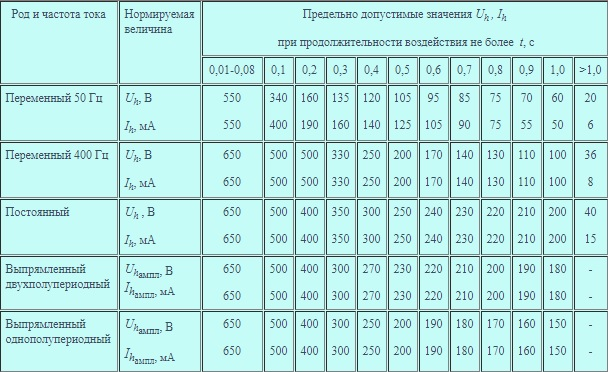

___
# Вопрос 4: Зависимость исхода поражения током от величины напряжения, частоты и  рода тока, длительности воздействия тока. Предельно допустимые значения напряжения прикосновения и тока через тело человека.
___

### Зависимость исхода поражения током от величины напряжения, частоты и рода тока

#### Величина тока

В нормальных условиях наименьший ток промышленной частоты, который вызывает физиологические ощущения у человека, в среднем равен 1 мА; для постоянного тока эта величина равна 5 мА.
Переменный ток промышленной частоты силой в 15 мА и более и постоянный ток силой 60 мА и более способны вызывать явление паралича органов движения и спазмы голосовых связок, при котором становится невозможным самостоятельный отрыв пострадавшего от электродов.

**С повышением величины тока опасность поражения увеличивается**

#### Продолжительность воздействия тока

Продолжительное воздействие электрического тока с параметрами, не представлявшими первоначально опасности для организма, может привести к гибели в результате снижения сопротивления тела человека. Первоначально замеренное омическое сопротивление тела человека, составляющее десятки тысяч омов, снижалось под воздействием электрического тока до нескольких сотен омов.

#### Род тока и частота

Постоянный ток производит в организме термическое и электролитическое действие, а переменный — преимущественно сокращение мышц, сосудов, голосовых связок и т. д. Установлено, что переменный ток напряжением ниже 500 В опаснее равного ему по напряжению постоянного тока, а при увеличении напряжения свыше 500 В увеличивается опасность от воздействия постоянного тока.
Среди переменных токов различной частоты наибольшую опасность представляют токи промышленной частоты 40—500 Гц. Токи высокой частоты (500 кГц и выше) безопасны с точки зрения внутренних поражений: они не вызывают электрического удара. Однако они могут вызвать ожог и не менее опасны, чем постоянные или переменные токи промышленной частоты.

### Предельно допустимые значения

